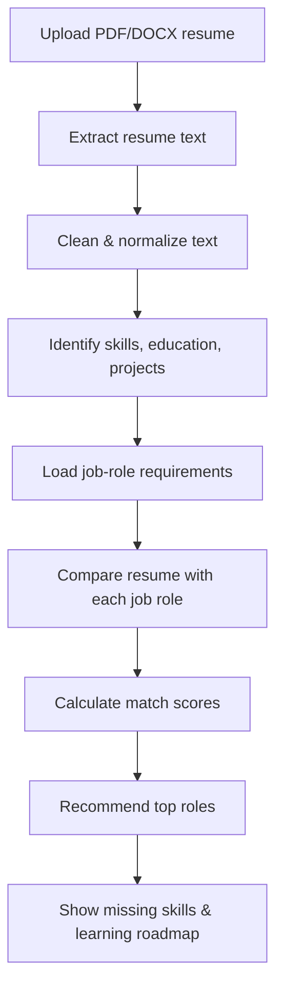

# AI Resume Analyzer & Job Recommendation System

An NLP-based Streamlit app that scores how well a resume matches different
job roles, lists missing skills, and generates a simple weekly learning
roadmap to close the gap.

Built to the "Student Project Guidance" spec: PDF/DOCX resume upload → text
extraction & cleaning → keyword-based skill extraction → TF-IDF + skill-overlap
matching against a job-role dataset → skill-gap analysis → Streamlit dashboard.

## Features

- Upload a **PDF or DOCX** resume (5MB max, validated)
- Extracts and cleans resume text while preserving tokens like `C++`, `C#`, `.NET`
- Detects 20-50+ skills across Programming, ML, Deep Learning, NLP, Computer
  Vision, Cloud, DevOps, Data/Visualization, and Web categories
- Compares the resume against **9 job roles** using a blended score:
  `0.6 × skill overlap + 0.4 × TF-IDF cosine similarity`
- Shows top-3 recommended roles, a horizontal bar chart of scores across all
  roles, missing skills for the target role, and a 4-week learning roadmap
- Downloadable `.txt` analysis report
- No personal attributes (name, age, gender, photo) are ever scored — see
  [Responsible AI Rules](#responsible-ai-rules)

## Project Workflow



## Folder Structure

```
ai_resume_analyzer/
|-- app.py                  # Streamlit dashboard (entry point)
|-- resume_parser.py        # PDF/DOCX text extraction
|-- text_cleaner.py         # Text cleaning/normalization
|-- skill_extractor.py      # Keyword-based skill detection
|-- job_matcher.py          # TF-IDF + skill-overlap matching
|-- roadmap_generator.py    # Rule-based weekly learning roadmap
|-- ai_feedback.py          # OPTIONAL: LLM feedback stub (not wired by default)
|-- requirements.txt
|-- README.md
|-- .env                    # Optional API keys (never commit real keys)
|-- .gitignore
|
|-- data/
|   |-- job_roles.csv       # 9 job roles + required skills
|   |-- skill_dictionary.csv# ~56 skills across 10 categories
|
|-- sample_resumes/         # 3 sample resumes for manual testing
|-- reports/                # (empty — reports are generated on the fly, not stored)
|-- tests/
    |-- test_cases.csv           # manual testing worksheet
    |-- test_pipeline.py         # automated smoke test
    |-- generate_sample_resumes.py
```

## Setup

```bash
# 1. Clone / open the project folder, then create a virtual environment
python -m venv venv
source venv/bin/activate        # Windows: venv\Scripts\activate

# 2. Install dependencies
pip install -r requirements.txt

# 3. Run the app
streamlit run app.py
```

The app opens at `http://localhost:8501`. Upload a PDF or DOCX resume from
`sample_resumes/` to try it immediately.

## Running the Tests

```bash
# Automated pipeline test (parses sample resumes, checks top-match role)
python tests/test_pipeline.py

# Regenerate the sample resumes if you ever need to edit them
python tests/generate_sample_resumes.py
```

Fill in `tests/test_cases.csv` (`Actual Top Role`, `Comments`) as you run
manual tests through the UI — this is the evaluation worksheet from the
project brief.

## Deployment (Streamlit Community Cloud)

1. Push this folder to a **public GitHub repository** (make sure `.env` is
   in `.gitignore` and never committed with real keys).
2. Go to [share.streamlit.io](https://share.streamlit.io), sign in with
   GitHub, and click **"New app"**.
3. Select your repo/branch, set **Main file path** to `app.py`, and deploy.
4. If you enable `ai_feedback.py`, add your API key under
   **App settings → Secrets** instead of committing `.env`.

Docker is also supported — build with a standard `python:3.11-slim` base
image, `pip install -r requirements.txt`, then
`CMD ["streamlit", "run", "app.py", "--server.port=8501", "--server.address=0.0.0.0"]`.

## How Matching Works (for the viva)

1. **Text extraction** — `pypdf` reads each PDF page; `python-docx` reads
   every paragraph and table cell.
2. **Cleaning** — lowercase, strip punctuation/whitespace, but protect
   symbol-heavy tokens (`C++`, `C#`, `.NET`) with placeholders before
   stripping, then restore them.
3. **Skill extraction** — regex whole-word/phrase matching against a
   controlled CSV dictionary (`data/skill_dictionary.csv`), grouped by
   category.
4. **Matching** — for each job role:
   - `skill_overlap` = (skills you have ∩ skills required) / (skills required)
   - `tfidf_similarity` = cosine similarity between TF-IDF vectors of the
     resume text and the role's required-skills text
   - `match_score = 0.6 × skill_overlap + 0.4 × tfidf_similarity`
5. **Skill-gap & roadmap** — required skills not found become "missing
   skills"; they're spread evenly across a 4-week roadmap with a short
   suggestion per skill (`roadmap_generator.py`).

### Beginner vs. Advanced Approach

This implementation uses the **beginner approach** from the brief (keyword
matching + TF-IDF + cosine similarity + rule-based roadmap) because it's
fast, free to deploy, and fully explainable. The code is modular so you can
upgrade to the **advanced approach** later without rewriting everything:

| Component | Current (beginner) | Advanced upgrade |
|---|---|---|
| Skill extraction | Regex keyword matching | spaCy NER / phrase matching |
| Matching | TF-IDF + cosine similarity | Sentence Transformers (semantic) |
| Roadmap | Static lookup table | LLM-generated (see `ai_feedback.py`) |
| Backend | Streamlit only | FastAPI backend + Streamlit/React frontend |
| Storage | None (in-memory) | SQLite/PostgreSQL for saved reports |

## Responsible AI Rules

- This tool is for **guidance only** — not automatic hiring or rejection.
- It never scores gender, age, religion, nationality, photo, marital
  status, or disability — only job-related skills, education, projects,
  and experience.
- Match scores are **estimates**, not recruiter decisions.
- Uploaded resumes are processed **in memory only** for the session; no
  file is written to disk or stored permanently.
- Missing a keyword does not always mean missing the underlying skill —
  the report explicitly says so.

## Suggested Viva Questions & Quick Answers

- **How do you extract text from a resume?** `pypdf` for PDFs (per-page
  `extract_text()`), `python-docx` for DOCX (paragraphs + table cells).
- **What is TF-IDF?** A weighting scheme that scores a word higher when it's
  frequent in a document but rare across all documents — it downweights
  common/generic words automatically.
- **What does cosine similarity measure?** The angle between two vectors;
  1.0 means identical direction (very similar text), 0 means unrelated.
- **Why can keyword matching miss relevant skills?** It only catches exact
  phrases from the dictionary — synonyms, abbreviations, or skills
  described differently in the resume won't be detected.
- **When should you use Sentence Transformers?** When you need semantic
  matching (e.g. "built ML pipelines" ≈ "machine learning engineering")
  rather than exact keyword overlap.
- **Why exclude protected attributes?** To avoid biased or discriminatory
  scoring and keep the tool legally and ethically sound.
- **How is the match score calculated?** `0.6 × skill_overlap + 0.4 ×
  tfidf_similarity` — see [How Matching Works](#how-matching-works-for-the-viva).
- **What are the limitations?** Keyword-based extraction can miss synonyms;
  scanned/image PDFs with no selectable text won't parse; the job-role
  dataset is small and manually curated rather than sourced from live job
  postings.

## Optional Advanced Features (not implemented by default)

Section 13 of the brief lists several optional upgrades. `ai_feedback.py`
is included as a **stub** (untested — the build environment has no
internet access to LLM providers) for LLM-generated resume feedback. Other
optional items (resume-section detection, job-description upload, user
login, FastAPI backend, Docker deployment) are straightforward extensions
of the modular structure above but are left out to keep the core
deliverable simple and fully working out of the box.
